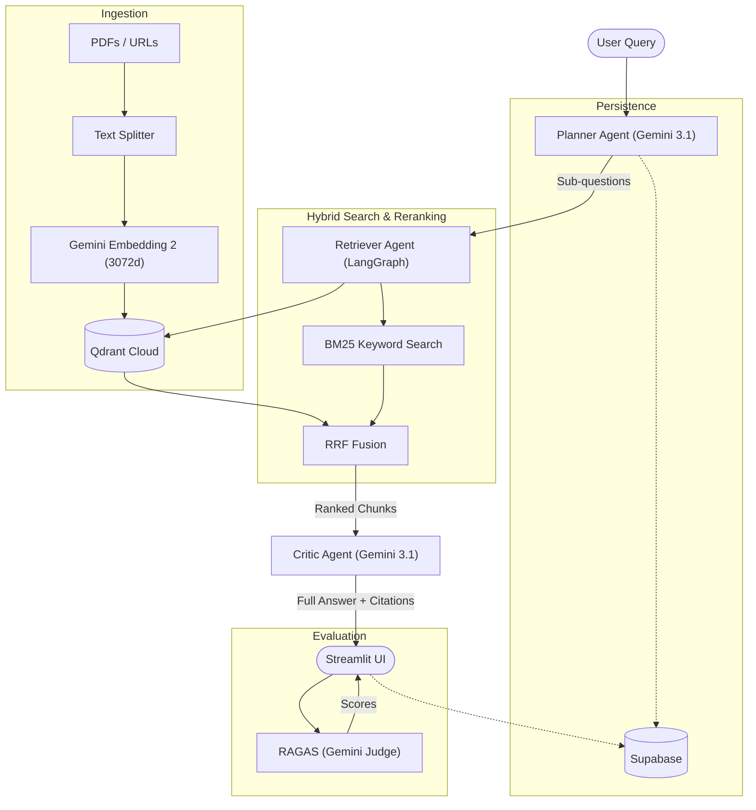

# Scholar-AI: Multi-Agent Research Assistant

Scholar-AI is a high-performance, multi-agent RAG (Retrieval-Augmented Generation) system built to analyze and synthesize information from documents with professional-grade accuracy.

## Key Features
- **Multi-Agent Orchestration**: Uses **LangGraph** to coordinate between a **Planner** (query decomposition), **Retriever** (semantic & keyword search), and **Critic** (synthesis & citation).
- **Hybrid Search & Reranking**: Combines **Qdrant Vector Search** with **BM25 Keyword Search** using **Reciprocal Rank Fusion (RRF)** for optimal document retrieval.
- **Web & File Ingestion**: Seamlessly ingest data from **public URLs**, webpages, and directly uploaded **PDFs**.
- **RAGAS Evaluation**: Built-in **Faithfulness** and **Relevancy** scoring powered by **Gemini 3.1** as the judge model.
- **Production UI**: Streamlit dashboard with real-time streaming, source visualization, and evaluation toggles.
- **Robust Persistence**: **Supabase** handles session history and document tracking.

## Architecture



## Technology Stack
- **LLM**: Gemini 3.1 Flash (Generation)
- **Embeddings**: Gemini Embedding 2 (3072 dimensions)
- **Vector DB**: Qdrant Cloud (with local in-memory fallback)
- **Database**: Supabase (PostgreSQL)
- **Framework**: FastAPI (Backend) & Streamlit (Frontend)
- **Orchestration**: LangChain & LangGraph

## Ingestion Strategy
- **Chunking**: Recursive Character Text Splitter (`chunk_size: 1000`, `overlap: 100`) tuned for academic and technical PDFs.
- **Metadata**: Sources are preserved and cited inline as `[Source: filename]`.

## Getting Started with Docker

1. **Clone the repository**
2. **Setup your `.env`** (see [.env.example](.env.example))
3. **Run with Docker Compose**:
   ```bash
   docker-compose up --build
   ```
4. **Access the App**:
   - Frontend: `http://localhost:8501`
   - Backend: `http://localhost:8000`

## Local Development

1. Create a virtual environment: `python -m venv venv`
2. Activate: `.\venv\Scripts\activate` (Windows) or `source venv/bin/activate` (Mac/Linux)
3. Install: `pip install -r requirements.txt`
4. Run Backend: `uvicorn app.main:app --reload`
5. Run Frontend: `streamlit run frontend/app.py`
